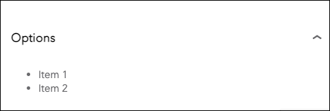
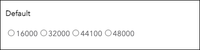
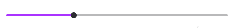
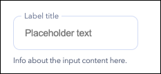
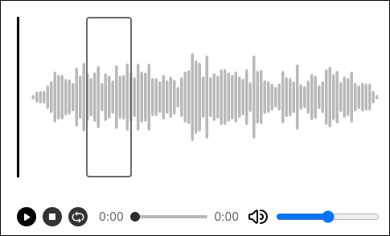

# Dolby.io Media Music Mastering UIKit for React

# Overview

The Dolby.io Music Mastering UIKit for React is designed to help React developers reduce the complexity of building and embedding a Dolby.io Music Mastering solution for the web.

- To see a Music Mastering kickstart app that shows the UIKit in action, check out our [GitHub](https://github.com/dolbyio-samples/media-app-react-music-mastering).

The package consists of the following element:

- **UI components**: Basic elements used to create a Music Mastering solution for the web.

# Getting Started


## Prerequisites

- React 16.5 or greater.
- A supported browser: Chrome 100+, Safari 15+, Firefox 100+, or Edge 100+

## Install the UIKit

Install the UIKit within the directory where your `package.json` file is located in your app.

Use [Yarn](https://yarnpkg.com/), install the UIKit with command:

```
yarn add @dolbyio/media-uikit-react
```

## Use a component

The following examples include a sample of the components available in the UIKit.

### **Accordion**

The Accordion component allows the user to show and hide sections of related content on a page.



```tsx
import { Accordion } from '@dolbyio/media-uikit-react';

const MyComponent = (props) => {
  return (
    <div>
      <Accordion expanded heading={<h3>Options</h3>}>
        <ul>
          <li>Item 1</li>
          <li>Item 2</li>
        </ul>
      </Accordion>
    </div>
  );
};
```

<br>
<br>

### **RadioGroup**

The RadioGroup component allows users to make one selection out of a list of options and only number types are supported.



```tsx
import { RadioGroup } from '@dolbyio/media-uikit-react';

const MyComponent = (props) => {
  return (
    <div>
      <RadioGroup
        defaultValue={3200}
        name="Default"
        onChangeValue={function noRefCheck() {}}
        values={[16000, 32000, 44100, 48000]}
      />
    </div>
  );
};
```

<br>
<br>

### **Slider**

The Slider component allows the user to set values on a continuous scale.



```tsx
import { Slider } from '@dolbyio/media-uikit-react';

const MyComponent = (props) => {
  return (
    <div>
      <Slider defaultValue={30} max={100} min={0} onChange={function noRefCheck() {}} />
    </div>
  );
};
```

<br>
<br>

### **TextField**

The TextField component allows users to enter and edit text.



```tsx
import { TextField } from '@dolbyio/media-uikit-react';

const MyComponent = (props) => {
  return (
    <div>
      <TextField
        caption="Info about the input content here."
        label="Label title"
        onChange={function noRefCheck() {}}
        placeholder="Placeholder text"
        value=""
      />
    </div>
  );
};
```

<br>
<br>

### **Waveform**

The Waveform component allows users to display a waveform of an audio track, choose a segment of the track for preview, select location of the playhead, adjust volume, and interact with transport controls and audio timeline bar. 



```tsx
import { Waveform } from '@dolbyio/media-uikit-react';

const MyComponent = (props) => {
  return (
    <div>
      <Waveform previewActive url="/media/my-track.wav" />
    </div>
  );
};
```

<br>
<br>

### **AudioConfigurator**

The AudioConfigurator component provides controls for selecting audio characteristics such as sample rate, channel count, and sample size.  


```tsx
import { AudioConfigurator } from '@dolbyio/media-uikit-react';

const MyComponent = (props) => {
  return (
    <div>
      <AudioConfigurator
        channelCounts={[1, 2]}
        defaultChannelCount={1}
        defaultSampleRate={44100}
        defaultSampleSize={16}
        onChangeChannelCount={function noRefCheck() {}}
        onChangeSampleRate={function noRefCheck() {}}
        onChangeSampleSize={function noRefCheck() {}}
        sampleRates={[44100, 48000]}
        sampleSizes={[16, 24, 32]}
      />
    </div>
  );
};
```
